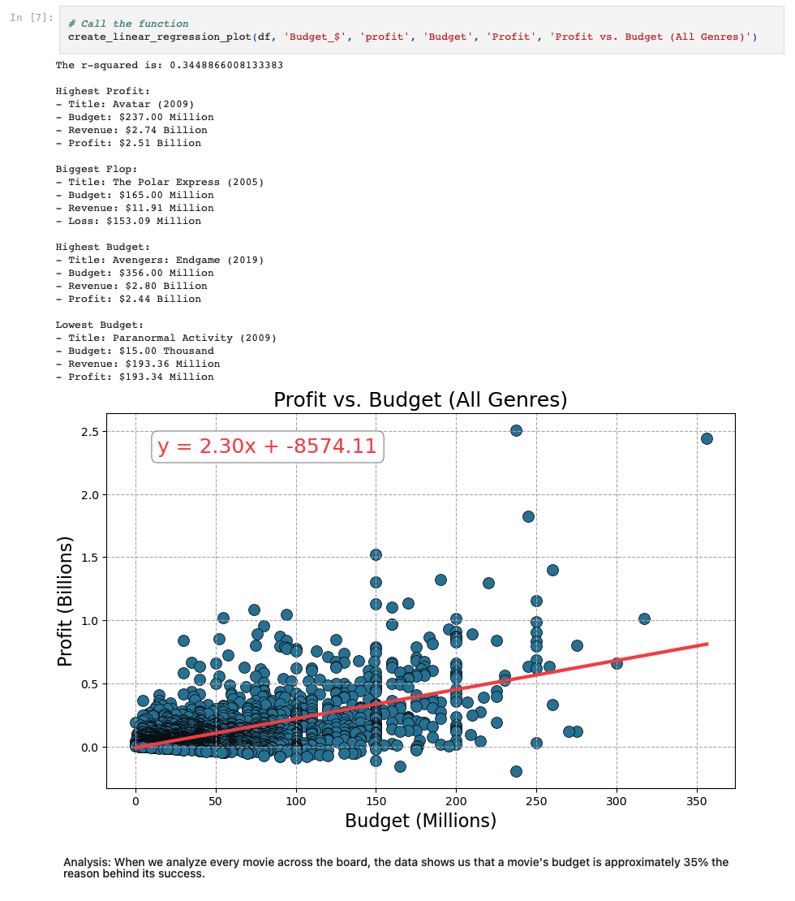

# project-1-group-18

## **Box Office Performance (1999-2019)**

This project analyzes movie box office performance from 1999 to 2019 using a dataset from Kaggle. We explored various factors influencing the film industry's financial landscape, including:

- **Genre Popularity**: Identified the most popular genres in both domestic and international markets.
- **Distributor Performance**: Compared the average profit and genre distribution of top distributors.
- **Movie Runtime**: Investigated the relationship between movie runtime and profitability across different genres.
- **Budget vs. Profit**: Examined the correlation between production budget and profit, considering genre-specific trends.

## Key Findings:

- Animation, Adventure, Sci-Fi are consistently top-performing genres.
- DreamWorks led in average profit per movie among top distributors.
- No strong correlation was found between movie runtime and profitability.
- Production budget correlates moderately with profit, with stronger correlations observed in specific genres like Action.

## Call to Action:

- **Filmmakers/Studios**: Embrace calculated risks with diverse budgets.
- **Investors**: Diversify film portfolios across genres and budgets.
- **Audiences**: Support a vibrant film industry by watching diverse movies.

## Limitations and Future Work:

- The dataset had missing budget information and was limited to pre-2020 data.
- The genre categorization method had limitations.
- Future work could incorporate more recent data, film ratings, and streaming trends.

This project provides valuable insights into the film industry's financial dynamics between 1999 and 2019. The findings can inform decision-making for filmmakers, investors, and audiences alike.
